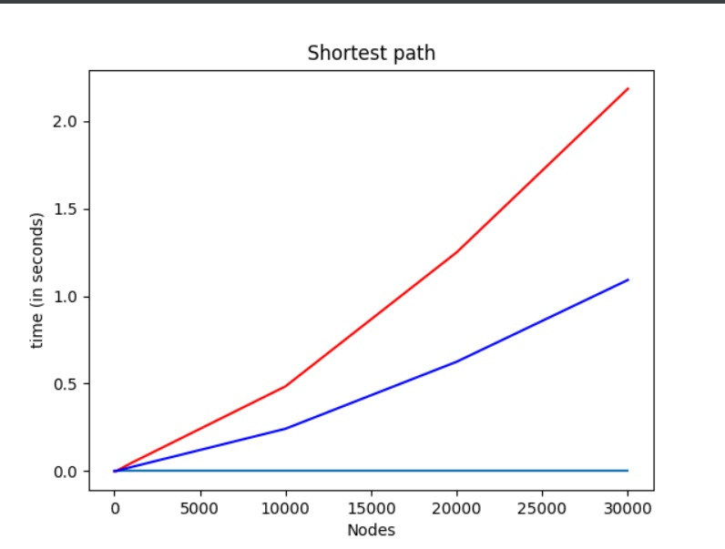
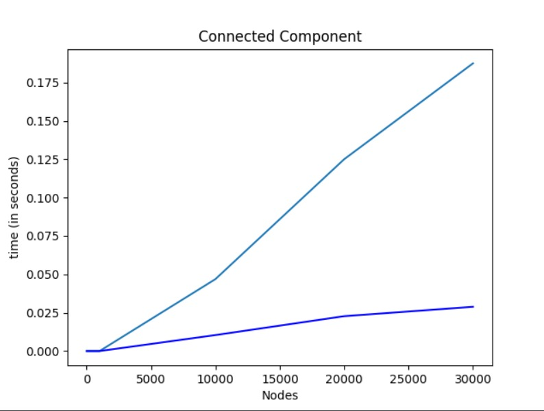
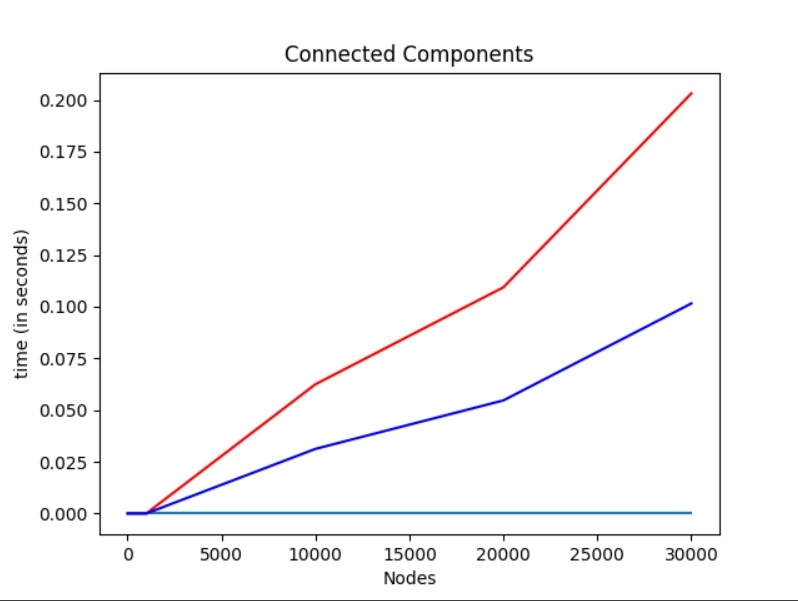
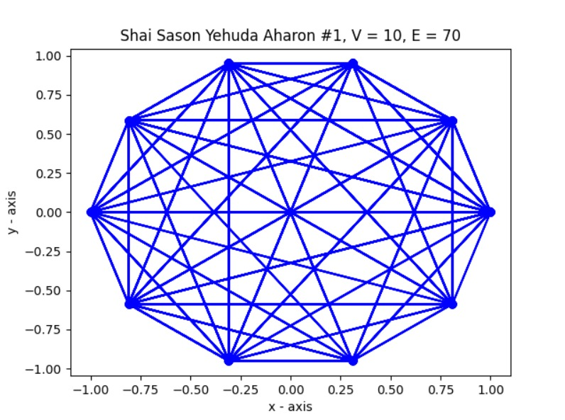
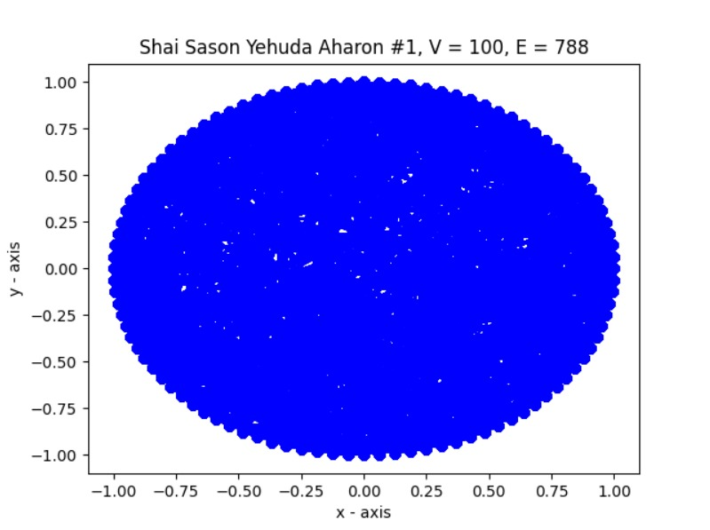
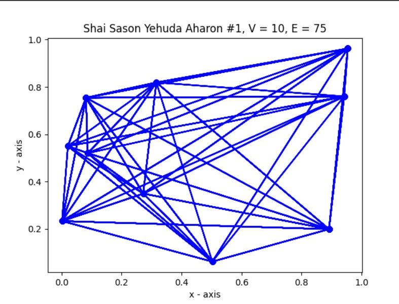

# OOP-EX3-Weighted-directed-graph

**Authors: Dor Yaakobi & Moti Daharif**

## Introduction
**This repository is a part of several exercises in OOP course,this assignment combines our previous implementations of a directed graph in JAVA and our 
new experience with python. In this repository we created a DiGraph Object to represent a directed weighted graph, and all of its attributes.
To the DiGraph object is manipulated using the GraphAlgo class, to explore the graph for the shortest path between two different vertices in the graph,
the vertices are a Node type object that we implemented as well to hold certain characteristics to enable the different algorithms to be performed. 
The repository contains the comparisons between our python & JAVA versions to pythons networkx version to show the efficiency differences
between them.**

**Click [Here](https://github.com/motidahari/motidahari-OOP-EX3-Weighted-directed-graph/archive/main.zip) to download this project.**

***
  # Project pakages and classes:
  ### Pakage: src

Class | Interface                   
------------ | -------------                    
DiGraph | GraphInterface
GraphAlgo | GraphAlgoInterface

- Node: Our implementation of a vertex in a graph.

- DiGraph: This class implements the GraphInterface and its methods, as well as several methods added for our use. 

- GraphAlgo: Implements GraphAlgoInterface  for the different methods and algorithms that would be manipulated on the DWGraph_DS.

The GraphAlgo class manipulate the graph structure for several uses. As well as using different algorithms to explore the graph 
for shortest path between two given nodes using Dijkstra's algorithm, and to check for SCC using Tarjan's strongly connected components algorithm.
    
[Tarjan's strongly connected components algorithm - WIKI](https://en.wikipedia.org/wiki/Tarjan%27s_strongly_connected_components_algorithm)

    
[Dijkstra's algorithm - WIKI](https://en.wikipedia.org/wiki/Dijkstra%27s_algorithm)
   
[Dijkstra's algorithm illustration](https://www.youtube.com/watch?v=pVfj6mxhdMw&t=193s&ab_channel=ComputerScience)

****

### Digraph methods and complexity:

####The class is implemented using three key dictionaries:

* Vertices = Contains all of the vertices belonging to the graph (because there might be vertices that are not connected to other vertices yet they are still a part of the graph).

* Neighbours In = The arrow/edge that connects two nodes is directed from the head to the tail (x--->y), the values stored inside it are the keys (node id) of the edges head.   

* Neighbours Out = The arrow/edge that connects two nodes is directed from the head to the tail (x--->y), the values stored inside it are the keys (node id) of the edges tails.   

Method | Description | Complexity                  
------------ | -------------|----------                     
__init__()              |Constructor to create a new DiGraph Object with all it's characteristics.| O(1)
add_node()              |Adds a new node to the graph, in case the node already exists in the graph it will not be added again. |O(1)
remove_node()           |Removes a node from the graph by the specified id | O(E)
addEdge()               |Adds an edge to the graph when id1 is the head and id2 is the tail.| O(1)
removeEdge()            |Removes an edge from the graph, when id1 is the head and id2 is the tail| O(1)
all_in_edges_of_node()  |Returns a dictionary of the nodes connected to it (heads)| O(1)
all_out_edges_of_node() |Returns a dictionary of the nodes it is connected to (tails)| O(1)
v_size()                |Returns the number of vertices in this graph | O(1)
e_size()                |Returns the number of edges in this graph   | O(1)
get_mc()                |Returns the current amount of changes made to the graph.| O(1)
e_size_by_id()          |Returns the number of edges in this graph for the desired node| O(1)
get_all_v()             |Returns a dictionary view of all existing vertices in the graph in format of {key: Integer, value: Node}| O(1)
get_v_keys()            |Returns a dictionary view of all the keys contained in the graph| O(1)
get_items()             |Returns a dictionary view of all the items contained in the graph| O(1)
get_all_values()        |Returns a dictionary of all the values in the graph (Node Objects).| O(1)
__str__()               |Returns a String representing the graph | O(V+E) 

 ####__str__() Example:

    (0 -> 2) w = 25.068566978163332, 
    (0 -> 3) w = 42.21788539643512, 
    (0 -> 4) w = 55.58843919899137, 
    (0 -> 5) w = 55.425375330029794, 
    (0 -> 6) w = 37.01089239197957, 
    (0 -> 7) w = 77.21057152591118, 
    (0 -> 8) w = 38.87352979733993, 
    (0 -> 9) w = 34.25892844218011, 
    (1 -> 0) w = 70.93102978445458, 
    (1 -> 2) w = 61.50378944986711, 
    etc.

### GraphAlgo methods and complexity:

Method | Description | Complexity                  
------------ | -------------|----------
__init__()              |Initialize the DiGraph to a GraphAlgo to implement the methods on.|O(1)
createTransposedGraph() |Generate a new DiGraph with the reversed directions of the edges of the original graph.|
setAllTags()            |Resets the tags of all the Node in the graph.|O(V)
getAllTags()            |Returns the tags of all the Node in the graph.|O(1)
setAllWeightAndInfo()   |Sets the weight and info to all the Nodes.|O(V)
printAllTags()          |Prints all the tags.|O(V)
get_graph()             |Returns the DiGraph which the algorithms are operated on.|O(1)
get_transposed_graph()  |Returns the transposed Digraph.|O(1)
load_from_json()        |Loads a DiGraph from a json file format.|O(V+E)
save_to_json()          |Saves a DiGraph to a json file format.|O(V+E)
shortest_path()         |Finds the shortest path between two given node id.|O(V+E)
connected_component()   |Returns a List representing the SCC related to a given vertex.|O(V*(V+E))
connected_components()  |Returns a List of lists containing all the SCC of the given graph.|O(V*(V+E))
splitPos()              |Splits the string received from a json file to the pos of the Node.|O(1)
plot_graph()            |Display the graph in a graphics window.|O(V+E)

###Graphs visuilazations and Comparisons:

* *Red = JAVA*
* *Dark Blue = Our python implementation* 
* *Light Blue = python networkX* 

 

    
    Example of graph string output:

    Vertices: 10, Edges: 70, MC: 80
    Graph's nodes predecessors = { #0 in -> :{2: 20.32927659218075, 3: 79.44500875000745, 4: 44.630151839306954, 5: 10.330559391069462, 6: 79.40127823775842, 7: 13.540448611094906, 8: 36.21817515893986, 9: 18.795560638889896}
    #1 in -> :{0: 30.41763241754926, 2: 33.09958724559113, 4: 75.97510297236161, 5: 64.96788831783256, 8: 27.95723796652554, 9: 52.16829691396408}
    #2 in -> :{0: 5.222720639544136, 1: 55.634319236347004, 3: 0.19844075676367479, 4: 54.360674481191516, 6: 20.114713803486012, 7: 70.446231081275}
    #3 in -> :{0: 61.540474801988395, 1: 46.09408949974762, 2: 1.3859528226530131, 4: 40.06550642488482, 5: 1.2532893145708224, 6: 48.543943880737324, 8: 64.68232930755588, 9: 61.231755622547205}
    #4 in -> :{0: 1.4254324246464245, 1: 21.506152804579607, 3: 11.051960610655769, 5: 44.63963719095241, 6: 51.93954623081834, 7: 61.39605204940575, 8: 30.97565078156314, 9: 52.32276569469346}
    #5 in -> :{2: 19.148756160560012, 3: 12.616628926759029, 7: 2.680329249746613, 8: 18.735311643115136}
    #6 in -> :{0: 29.62317157192879, 1: 32.542031972906635, 2: 68.5725612585445, 3: 25.290332627359888, 4: 30.30431054074055, 5: 70.62368856451643, 7: 11.518508280697107, 8: 62.8711699606534, 9: 54.70505267245872}
    #7 in -> :{1: 40.0879200213138, 2: 34.03119476857865, 3: 20.770897308737464, 4: 65.67025086708223, 5: 17.670240063160367, 6: 40.169197318471696, 8: 71.5334551162375, 9: 8.796334140129307}
    #8 in -> :{0: 77.69682104395123, 3: 43.22654923244013, 5: 33.54262532947976, 6: 31.45128269162786, 7: 8.571623994115237, 9: 30.209681940090736}
    #9 in -> :{1: 78.75421229608374, 2: 45.38199711844628, 3: 36.47021817121635, 4: 46.21390777683535, 6: 42.42967001833669, 7: 21.043957151829343, 8: 80.03878406006915}
    }
    
    Graph's nodes successors  = { 
    #0 out -> :{1: 30.41763241754926, 2: 5.222720639544136, 3: 61.540474801988395, 4: 1.4254324246464245, 6: 29.62317157192879, 8: 77.69682104395123}
    #0 out -> :{1: 30.41763241754926, 2: 5.222720639544136, 3: 61.540474801988395, 4: 1.4254324246464245, 6: 29.62317157192879, 8: 77.69682104395123}
    #1 out -> :{2: 55.634319236347004, 3: 46.09408949974762, 4: 21.506152804579607, 6: 32.542031972906635, 7: 40.0879200213138, 9: 78.75421229608374}
    #1 out -> :{2: 55.634319236347004, 3: 46.09408949974762, 4: 21.506152804579607, 6: 32.542031972906635, 7: 40.0879200213138, 9: 78.75421229608374}
    #2 out -> :{0: 20.32927659218075, 1: 33.09958724559113, 3: 1.3859528226530131, 5: 19.148756160560012, 6: 68.5725612585445, 7: 34.03119476857865, 9: 45.38199711844628}
    #2 out -> :{0: 20.32927659218075, 1: 33.09958724559113, 3: 1.3859528226530131, 5: 19.148756160560012, 6: 68.5725612585445, 7: 34.03119476857865, 9: 45.38199711844628}
    #3 out -> :{0: 79.44500875000745, 2: 0.19844075676367479, 4: 11.051960610655769, 5: 12.616628926759029, 6: 25.290332627359888, 7: 20.770897308737464, 8: 43.22654923244013, 9: 36.47021817121635}
    #3 out -> :{0: 79.44500875000745, 2: 0.19844075676367479, 4: 11.051960610655769, 5: 12.616628926759029, 6: 25.290332627359888, 7: 20.770897308737464, 8: 43.22654923244013, 9: 36.47021817121635}
    #4 out -> :{0: 44.630151839306954, 1: 75.97510297236161, 2: 54.360674481191516, 3: 40.06550642488482, 6: 30.30431054074055, 7: 65.67025086708223, 9: 46.21390777683535}
    #4 out -> :{0: 44.630151839306954, 1: 75.97510297236161, 2: 54.360674481191516, 3: 40.06550642488482, 6: 30.30431054074055, 7: 65.67025086708223, 9: 46.21390777683535}
    #5 out -> :{0: 10.330559391069462, 1: 64.96788831783256, 3: 1.2532893145708224, 4: 44.63963719095241, 6: 70.62368856451643, 7: 17.670240063160367, 8: 33.54262532947976}
    #5 out -> :{0: 10.330559391069462, 1: 64.96788831783256, 3: 1.2532893145708224, 4: 44.63963719095241, 6: 70.62368856451643, 7: 17.670240063160367, 8: 33.54262532947976}
    #6 out -> :{0: 79.40127823775842, 2: 20.114713803486012, 3: 48.543943880737324, 4: 51.93954623081834, 7: 40.169197318471696, 8: 31.45128269162786, 9: 42.42967001833669}
    #6 out -> :{0: 79.40127823775842, 2: 20.114713803486012, 3: 48.543943880737324, 4: 51.93954623081834, 7: 40.169197318471696, 8: 31.45128269162786, 9: 42.42967001833669}
    #7 out -> :{0: 13.540448611094906, 2: 70.446231081275, 4: 61.39605204940575, 5: 2.680329249746613, 6: 11.518508280697107, 8: 8.571623994115237, 9: 21.043957151829343}
    #7 out -> :{0: 13.540448611094906, 2: 70.446231081275, 4: 61.39605204940575, 5: 2.680329249746613, 6: 11.518508280697107, 8: 8.571623994115237, 9: 21.043957151829343}
    #8 out -> :{0: 36.21817515893986, 1: 27.95723796652554, 3: 64.68232930755588, 4: 30.97565078156314, 5: 18.735311643115136, 6: 62.8711699606534, 7: 71.5334551162375, 9: 80.03878406006915}
    #8 out -> :{0: 36.21817515893986, 1: 27.95723796652554, 3: 64.68232930755588, 4: 30.97565078156314, 5: 18.735311643115136, 6: 62.8711699606534, 7: 71.5334551162375, 9: 80.03878406006915}
    #9 out -> :{0: 18.795560638889896, 1: 52.16829691396408, 3: 61.231755622547205, 4: 52.32276569469346, 6: 54.70505267245872, 7: 8.796334140129307, 8: 30.209681940090736}
    #9 out -> :{0: 18.795560638889896, 1: 52.16829691396408, 3: 61.231755622547205, 4: 52.32276569469346, 6: 54.70505267245872, 7: 8.796334140129307, 8: 30.209681940090736}
    }

   

